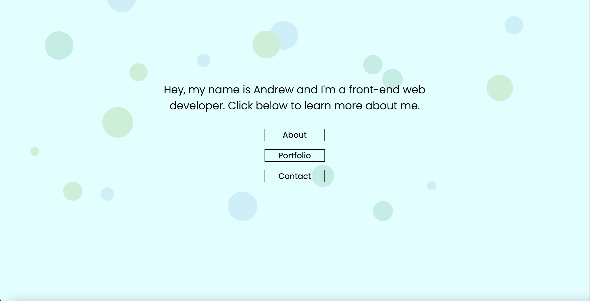
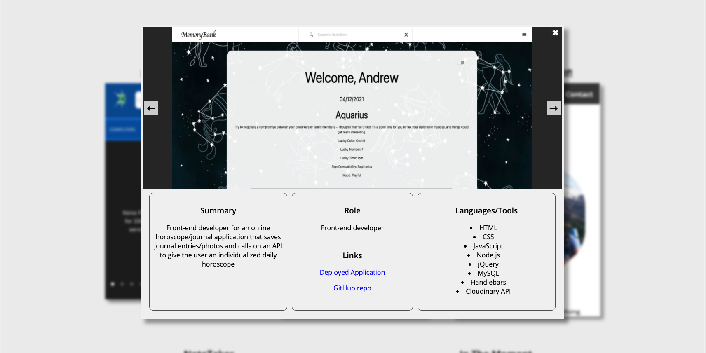

# Portfolio

## What, Why, and HOW
This is my main portfolio! With the exception of the contact form, I built everything in it from scratch. No frameworks. No copy/paste. I spent a lot of time trying to work my way through figuring out the design, and I'm really happy with how it all came together. Although the portfolio looks pretty straightforward, there are lots of little things on the page that were tricky to get right when it came to sizing and dynamic resizing. Tons of images, icons, carousels, modals, etc. On their own pretty straightforward, but displaying them all together with the correct spacing/size (even on mobile) can get very tricky. Ulimately, really happy with this experience. It really grew my skills and understanding of CSS, and it also taught me some about how to use JavaScript for cool style features (ie my Navbar, which only fixes to the top of the screen once you scroll down a certain amount).
To achieve the end result, I:
1. Wireframed out what I wanted the portfolio to look like on draw.io
2. Designed each section piece by piece, with the landing section and the About section coming first
3. Spent a LOT of time building dynamic modals (which house the carousels) from scratch.
4. Implemented a modal/carousel for each project card in the Projects section
5. Created a contact form by utilizing the mailthis.to API (this API send me an email whenever a user submits a message)
 
Overall, a really fun experience designing my portfolio. I haven't had a lot of opportunities to work on projects that are completely my own from start to finish with no instructions to follow, and I found myself really enjoying the process.

# Links
Link to GitHub repo: https://github.com/andrew1835/Portfolio
 
Link to deployed application: https://andrew1835.github.io/Portfolio/

# Screenshot
The first image shows what the page looks like when you load it up. The second screenshot shows what the modal looks like when you click on one of the project cards. 

